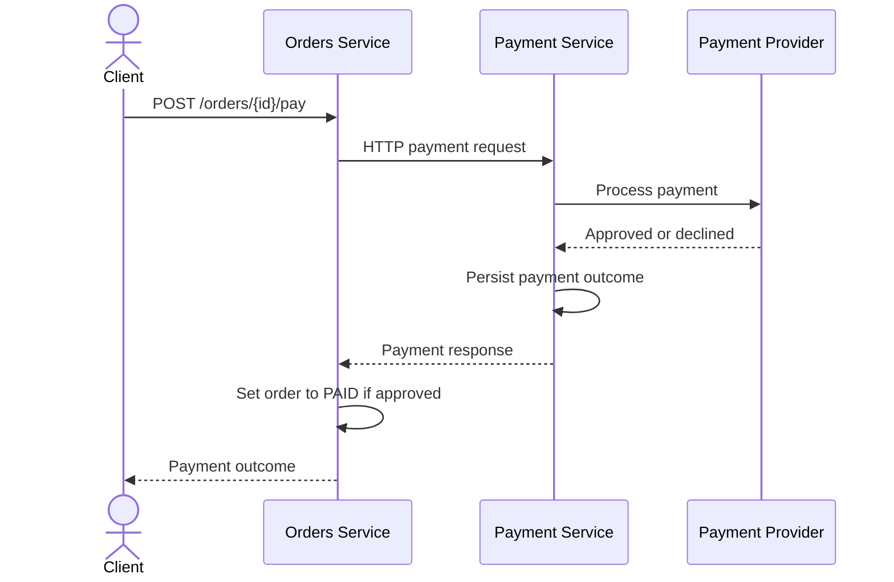
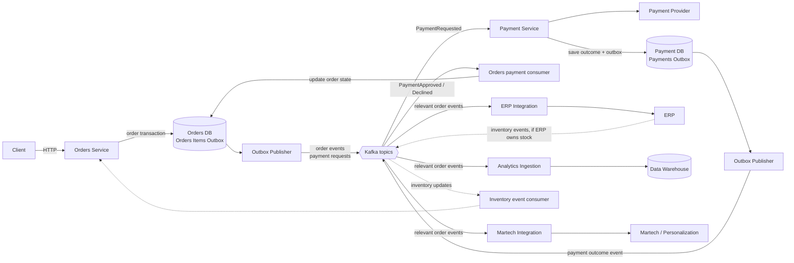

# Evolution Design

## 1. Objective
The implemented solution intentionally uses synchronous HTTP communication
between the Orders and Payment services to keep the runnable application small
and focused.

This document describes how this simple solution could evolve toward an
architecture capable of supporting approximately 500,000 orders per day,
handling traffic spikes, and reliably distributing order information to
downstream systems such as ERP, Data Warehouse, and Martech platforms.

## 2. Current Solution and Limitations
The current flow is synchronous and rigid with our services spending a significant percentage of their active life simply waiting.

In no other case is this more obvious and with a higher potential of high cost failures then with the payment system.
Which looks like this:



This couples the availability and response time of the Orders Service to both
the Payment Service and the external provider. While the call is in progress,
the Orders Service request thread waits; its database transaction and
connection also remain open. The Payment Service similarly waits for the
provider. Slow or unavailable dependencies can increase latency and consume
request threads and database connections.

The more important issue is the gap between two independent database
transactions and an external payment action.
For example, the provider may approve and charge a payment, and the Payment
Service may save that approval, but the Orders Service may crash before it saves
the order as `PAID`. The order then still appears `PENDING`, even though the
customer has been charged. The synchronous response may be lost, and the current
flow has no automatic way to deliver the recorded outcome to the Orders Service
later so a new flow may be needed to link approved payments to pending orders.
Retrying without first resolving the original presents a big risk of double
charging for the order.

The Payment Service has a similar failure window: the provider may approve a
charge, but the Payment Service may fail before it records the outcome. It
cannot safely treat that as a declined payment. A cancellation is not a
reliable general solution since the provider may not support it, the cancellation
could fail as well, and an approved charge may require a refund instead. This
outcome could harm caused to customers and the business far more than a simple temporary
service outage.

### When purely synchronous architecture hits a wall
All of these problems would be greatly exacerbated if we kept this fully synchronous
approach while adding downstream consumers, our services would have to wait for
each external actor to respond before continuing to the next one.

For example, a design that called each external integration synchronously
could produce a sequential flow like this:
POST /orders/1

```text
Orders
|
| HTTP request
v
ERP / Inventory
|
| response
v
Orders
|
| HTTP request
v
Data Warehouse
|
| response
v
Orders
|
| HTTP request
|
...
```


## 3. Target Architecture

The target design moves work that does not need to finish during the client's
request onto asynchronous event flows. This would be enabled by using an event-driven
architecture powered by Kafka. The Orders Service would remain responsible
for accepting an order and recording its state. It would write the order changes
and corresponding outbox record in one database transaction, then a publisher forwards
committed outbox records to Kafka. Payment outcomes are also published from the
Payment Service's durable records so Orders can apply them after recovering
from downtime. They use the same event channel as other service communication,
with each service processing messages relevant to its responsibilities.

Kafka also makes the relevant messages available to independent consumer
groups. The Payment Service still handles payment requests and publishes outcomes;
the Orders Service consumes those outcomes to update order state. Independent
ERP, Data Warehouse, and Martech consumers receive relevant events in parallel.
Each consumer can process at its own pace, so very crucially, a slow or unavailable
downstream system does not hold up order creation or prevent other consumers from
progressing.

The diagram is an overview of the intended boundaries and message flow. It
does not mean every consumer receives every event: topics and subscriptions
are chosen according to each integration's responsibilities.



The solid arrows show the main order and payment flows; dashed arrows show an
optional inventory feedback flow if inventory is owned by an ERP. Kafka
delivers each topic to independently managed consumer groups, rather than
making the services call external systems one at a time. Messages are persisted
and processed asynchronously, so the HTTP request does not wait for Payment,
ERP, the Data Warehouse, or Martech to finish.

The API can acknowledge an accepted order or payment request while the final
payment state is observed later. More information about the API contract and
delivery guarantees is covered in the following sections.


## 4. Moving from Synchronous HTTP to Events

We would not necessarily entirely abandon HTTP communication between our services.
The Orders Service can accept the payment request, persist a `PAYMENT_PENDING` state
and a `PaymentRequested` outbox record to be processed when possible, then return
immediately something like this:

```http
POST /orders/123/pay

202 Accepted
Location: /orders/123
{
  "order_id": 123,
  "status": "PAYMENT_PENDING"
}
```

The `202` means processing has started, not that payment succeeded. The client
could poll `GET /orders/123` to observe the eventual state.

Internally, how I imagine this could work would be something like this:
The Payment Service would consume `PaymentRequested` from Kafka
instead of being called synchronously by Orders. It would process the payment,
persist its result and an outcome event, then publish `PaymentApproved` or
`PaymentDeclined`. The Orders Service would consume that outcome and update the
order to `PAID` or a suitable declined/retryable state. Both services need
durable event handling so a restart or redelivery does not lose the
result or apply it twice. Every consumer should be designed for at-least-once
delivery as far as it is possible.


## 5. Transactional Outbox

I have already implicitly mentioned it a few times, so I will explain
shortly how the transactional outbox pattern works for our solution:


When a service updates its database and publishes an event, doing these as
separate operations can lose or misreport events: the database commit may
succeed while the Kafka publish fails, or an event may be published for a
transaction on our database that later rolls back. The transactional outbox
avoids this so called dual-write problem.

Each service adds an `outbox` table to its database. In one local transaction,
it saves both the business change and an outbox row describing the event. A
separate publisher reads committed rows and sends them to Kafka, retrying if
Kafka is unavailable. For example, Orders would save an order change and
`PaymentRequested` together; Payment would save its payment result and
`PaymentApproved` or `PaymentDeclined` together.

This is a modest schema addition, but it changes communication from direct
service-to-service HTTP calls to durable messages: services publish through
their outbox, and other services react by consuming events. Delivery can be
repeated, so again, its important consumers handle duplicate events safely.


## 6. Kafka Topics and Consumers

Topics can follow service ownership and distinguish commands from events. For
example, `payments.commands.v1` could carry `PaymentRequested` messages for
the Payment Service, while `payments.events.v1` carries the resulting
`PaymentApproved` or `PaymentDeclined` outcomes back for Orders to consume.

Order lifecycle events such as `OrderCreated`, `OrderPaid`, `OrderCancelled`,
and `OrderFulfilled` could be published to `orders.events.v1`. The ERP
integration, Data Warehouse ingestion, and Martech integration would each use
their own consumer group to receive the relevant events independently; one
consumer group per topic would make them compete for messages rather than each
receiving a copy. If inventory is in scope, its owning system could publish
events on a separate `inventory.events.v1` topic.

These names and boundaries are examples, not a fixed contract. Messages could
be keyed by `order_id` where per-order ordering matters, and versioned schemas
would let producers and consumers evolve without requiring a coordinated
release.

Kafka also supports scaling consumers horizontally: instances in the same
consumer group share a topic's partitions, processing different messages in
parallel. For an international retailer, messages could include a region and
be routed explicitly to regional topics, such as EU, North America, and Asia,
allowing each region to have its own processing capacity and policies. Consumer
groups do not filter by region automatically; the producer or a routing layer
must choose the topic, or consumers must filter messages themselves. Within
each topic, parallelism is bounded by its partition count. Regional routing may
be useful for a retailer operating across multiple markets, but should be based
on actual requirements such as data residency, local processing, or regional
traffic patterns.


## 7. Downstream Integrations

Each integration should have its own consumer group and a small adapter that
translates the shared order events into the format and protocol expected by
that system. This keeps vendor-specific APIs and failures out of the Orders
Service, and lets each integration retry or catch up independently. Repeated
failures can be isolated for investigation and replay rather than blocking
unrelated consumers.

- **ERP:** Send business events such as order placed, paid, cancelled, or
  fulfilled to the ERP for finance and operational workflows. If the ERP owns
  inventory, its stock or reservation responses should come back as explicit
  inventory events.
- **Data Warehouse and live activity:** Stream order lifecycle events into the
  warehouse for reporting and historical analysis. For live operational
  dashboards, a separate stream processor can maintain near-real-time counts
  and activity views in a query-optimized store, rather than making dashboards
  query Kafka or adding reporting load to the Orders database. These views are
  eventually consistent, so their freshness should be visible to users.
- **Martech and personalization:** Consume only the customer and order signals
  needed for segmentation and personalization. Apply consent, retention, and
  data-minimization rules; do not broadcast payment details or unnecessary
  personal data to every consumer.

Kafka provides a durable internal event stream, but it does not make external
ERP or Martech APIs reliable by itself. Each adapter still needs bounded
retries, monitoring, and a recovery/replay process for events the external
system cannot accept.


## 8. Scalability

500,000 orders per day is an average of about 5.8 orders per second. That average
is useful context, but it is not enough to size the system: promotions or other
events can create much higher short-lived peaks.

What is known formally as the Slashdot effect and usually called "the hug of death" by
users who experience it is a common phenomenon where a website, often a small retailer,
suffers slowdowns or even downtime from too much traffic at once. It is critical for any
retailer with a large internet presence to be ready for those moments of very high usage.
To prepare for them the business should define an expected peak rate and recovery-time goals.

#### Scale service instances horizontally

Orders and Payment instances should be stateless: any instance can handle a
request, with durable state held in each service's database or Kafka. A load
balancer can then distribute requests across instances, and instances can be
added independently as demand grows.

```text
             ┌── Orders instance 1
Load Balancer├── Orders instance 2
└── Orders instance 3
```

Using REST is not by itself what makes a service horizontally scalable however
some of its properties enable it. The important properties are stateless instances,
externalized shared state, and avoiding single-instance bottlenecks.

#### Scale asynchronous processing

Kafka can absorb short bursts by buffering messages, and consumer groups can
scale processing by adding instances up to the number of partitions. This
separates the rate at which orders are accepted from the rate at which payment
and downstream work is completed. Kafka does not remove overload: if producers
consistently outpace consumers, lag grows. It does however enable a sort of "debt"
that can be carried over to calm moments by using those to sort out any backlog
with the spare capacity. Still though, consumer lag, processing errors, and
publish rates should be monitored, and capacity or backpressure policies should
be adjusted before the backlog becomes unsafe.

#### Scale the database deliberately

The database may become the bottleneck even when application instances and
Kafka scale out. Measure query and write load, then tune indexes, connection
pools, and database capacity. Read replicas can help if reads become the limiting
workload. Partitioning or sharding should be considered only when measurements
justify the additional operational and consistency complexity.

Payment processing also needs to respect the provider's rate limits. Retries
and duplicate message delivery must use stable idempotency keys so scaling out
Payment consumers does not create duplicate charges.

## 9. Trade-offs

| Choice | Benefit | Cost / trade-off |
|---|---|---|
| Synchronous REST between services | Simple request flow, immediate result, straightforward to develop, test, and debug | Services depend on one another's availability and latency; failures can leave an ambiguous outcome |
| Kafka for internal asynchronous work | Decouples processing, buffers bursts, and lets consumers progress independently | Adds broker operations, monitoring, schema management, and asynchronous failure handling |
| Transactional outbox | Keeps a database change and its event record consistent | Adds an outbox table, publisher, cleanup, and operational monitoring |
| Asynchronous payment | Orders need not wait for the provider; payment processing can scale independently | Eventual consistency and a longer-lived payment state; requires idempotency and recovery handling |
| Separate integration consumers | ERP, analytics, and Martech failures and processing rates are isolated | More adapters, deployments, and data contracts to maintain |
| PostgreSQL as the service database | Familiar relational model and strong transactional guarantees | Can become a write or connection bottleneck; scaling requires measurement and deliberate choices |

An asynchronous event-driven architecture can improve decoupling and recovery,
but it does not automatically make a system more reliable. It introduces more
components and failure modes to operate. A simple synchronous design has fewer
moving parts, though failures in a synchronous dependency chain can affect the
whole request and leave ambiguous outcomes.

These trade-offs are not a case for replacing every REST call with Kafka. A
synchronous REST API remains a good fit when the caller needs an immediate
answer, the dependency is reliable and fast, and traffic and integration
requirements are modest. It is easier to understand and operate than a
distributed event flow.

The proposed direction is intentionally hybrid: keep HTTP at the client-facing
API, and use events where work can complete later or must be delivered
independently to multiple consumers. For a smaller workload without burst or
downstream integration needs, the current simpler design may have the better
cost-benefit balance. Introduce additional infrastructure when measured load,
availability targets, or integration requirements justify its cost.

## 10. Migration

Avoid a risky big-bang rewrite. A gradual migration could proceed in stages:

1. Define service ownership and contracts, then separate the Orders and Payment
   databases without changing the client API.
2. Add an outbox and validate event publication while retaining the existing
   synchronous payment flow.
3. Introduce consumers incrementally—for payment outcomes, then ERP, analytics,
   and Martech—with idempotency, monitoring, retries, and replay.
4. Change payment initiation to asynchronous `202 Accepted` only after the
   event flow and recovery behavior have been validated.

Use staged environments, observable rollout criteria, and rollback plans at
each stage. Involve people who understand the business rules so the migration
preserves behavior customers and downstream systems depend on.

## 11. Out of Scope

This is a high-level evolution proposal, not a complete implementation
specification. The following details are intentionally left for later design:

- A particular cloud/Kafka deployment and exact capacity settings
- Vendor-specific ERP/Martech/DWH connectors and detailed schemas
- Real payment-provider integration
- Inventory reservation and fulfilment workflows
